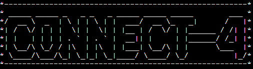

# CONNECT-4



Connect-4 is a python terminal game, which runs in the code institute mock terminal Heroku.

Players can try beat the computer to be the first player to connect 4 of your colored counters in a row.
Or if that gets too easy, players can play against each other!

[Click here for the live version](https://connect-4-ci.herokuapp.com/)

## How to Play
#### Objective:
* Be the first player to connect 4 of your colored counters in a row, either vertically, horizontally, or diagonally.

#### How to play:
* First, decide what color each player will be then decide who goes first through a random toin coss.
* Players alternate turns, only one counter can be used per turn.
* On your turn, drop one counter into any of the seven columns.
* The game ends when there is a 4-in-a-row or a stalemate/draw.

## Deployment:
This project was deployed using Code Institute's mock terminal for Heroku
* Steps for deployment:
    * Fork or clone this repository
    * Create a new Heroku app
    * Set the buildpacks to ```Python``` 

## Credits:
* Code institue for the deployement terminal.
* Wikipedia for the details of connect-4 game.

## Creating the Heroku app

When you create the app, you will need to add two buildpacks from the _Settings_ tab. The ordering is as follows:

1. `heroku/python`
2. `heroku/nodejs`

You must then create a _Config Var_ called `PORT`. Set this to `8000`

If you have credentials, such as in the Love Sandwiches project, you must create another _Config Var_ called `CREDS` and paste the JSON into the value field.

Connect your GitHub repository and deploy as normal.

## Constraints

The deployment terminal is set to 80 columns by 24 rows. That means that each line of text needs to be 80 characters or less otherwise it will be wrapped onto a second line.

-----
Happy coding!