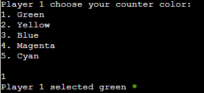
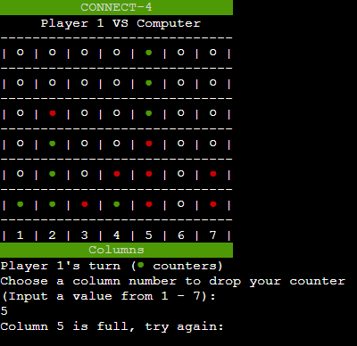

# CONNECT-4

Connect-4 is a python terminal game, which runs in the code institute mock terminal Heroku.

Players can try beat the computer to be the first player to connect 4 of your colored counters in a row.
Or if that gets too easy, players can play against each other!

[Click here for the live version](https://connect-4-ci.herokuapp.com/)

## How to Play
#### Objective:
* Be the first player to connect 4 of your colored counters in a row, either vertically, horizontally, or diagonally.

#### How to play:
* First, decide what color each player will be then decide who goes first through a random coin toss.
* Players alternate turns, only one counter can be used per turn.
* On your turn, drop one counter into any of the seven columns.
* The game ends when there is a 4-in-a-row or a stalemate/draw.

## Features
### Existing Features:
* Multiplayer
    * 1P vs CPU
    * 1P vs 2P

* Builds board

* Accepts user input
* 5 colors to choose from

* Maintains counter location and order
* 13 win conditions
    * 1 Vertical
    * 4 Horizontal
    * 8 Diagonal
* Input validation and error checking
    * You cannot input a number that does not exist in the menus
    * You must enter numbers
    

    * You cannot choose outside the range of columns
    
    * You cannot put two counters in the same spot
    * You cannot add to a full column
    

* Data is maintained in the class instances
    * Counter location is stored in Board class

### Future Features
* Allow player to change board size.
* Allow best of 3, 5 and possibly 7.
* Allow player to pick different game types with alternative rules.

## Data Model:
I decided to use both a Board class and Player classes as my model. 

The game creates an instance for the game board to hold the board size, VS title, layout, counter positions and also has a board `print` function.

While also creating two separate instances, one for each player to hold the name, counter color data and player type (Human or Computer).

## Testing:
I have manually tested this project by doing the following:
* Passed the code through a PEP8 linter and confirmed there are no problems.
* Given Invalid inputs: strings when numbers are expected, out of bound inputs, same input twice.
* Tested in my local terminal and the code institute Heroku terminal.

### Remaining Bugs:
* No bugs remaining

### Validator Testing:
* PEP8
    * No errors were returned from PEP8online.com

## Deployment:
This project was deployed using Code Institute's mock terminal for Heroku.
* Steps for deployment:
    * Fork or clone this repository
    * Create a new Heroku app
    * Set the buildpacks to `Python` and `NodeJS` in that order.
    * Link the Heroku app to the repository
    * Click on **Deploy**